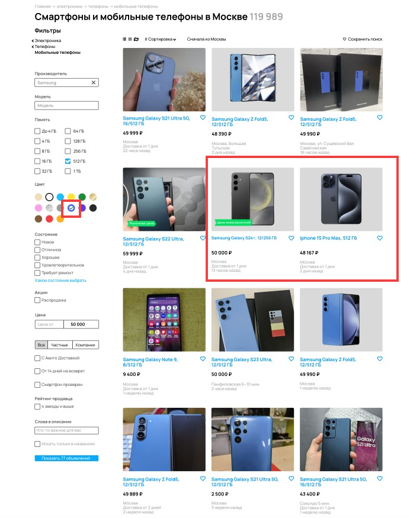
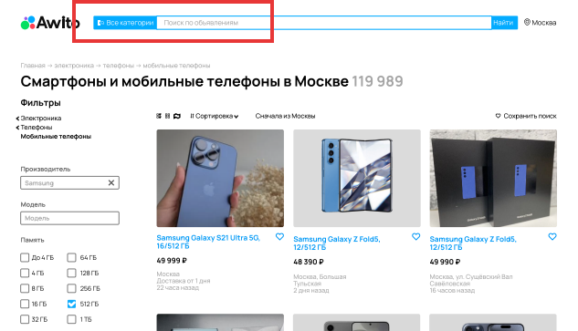
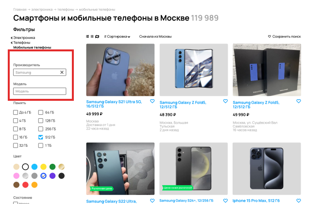

### Отчет о багах:

1. **Пропуск товаров с ценой 59 999О,хотя есть ограничение фильтров поиска по цене сверху "50 000":**
   - **Приоритет:** Medium
   - **Шаги воспроизведения:** 
   1. Перейти на сайт avito.ru
    2. Выбрать категорию электроника -> телефоны -> мобильные телефоны
     3. Применить фильтр по цене с ограничением сверху "50 000".
     4. Обратить внимание на результаты поиска, видно товары с ценой 59 999.
   - **Ожидаемый результат:** Товары с ценой 59 999 не должны быть отображены в результатах поиска.
   - **Фактический результат:** Товары с ценой 59 999 отображаются в результатах.
   - **Скриншот** 
   

2. **Пропуск устройств с памятью 256 ГБ, хотя есть ограничение фильтров поиска по памяти 512 ГБ**
   - **Приоритет:** Medium
   - **Шаги воспроизведения:** 
   1. Перейти на сайт avito.ru
    2. Выбрать категорию электроника -> телефоны -> мобильные телефоны
     3. Применить фильтр по объему памяти в 512 ГБ.
     4. Проверить результаты поиска на наличие устройств с памятью 256 ГБ.
   - **Ожидаемый результат:** Устройства с памятью 256 ГБ не должны быть включены в результаты поиска.
   - **Фактический результат:** Устройства с памятью 256 ГБ отображаются в результатах.

   

3. **Пропуск устройств Apple, хотя есть фильтр по производителю "Samsung":**
   - **Приоритет:** Medium
   - **Шаги воспроизведения:** 
    1. Перейти на сайт avito.ru
    2. Выбрать категорию электроника -> телефоны -> мобильные телефоны
     3. Применить фильтр по производителю "Samsung".
     4. Просмотреть результаты поиска на наличие устройств Apple.
   - **Ожидаемый результат:** Устройства Apple не должны быть включены в результаты поиска по производителю Samsung.
   - **Фактический результат:** Устройства Apple отображаются в результатах.
   

4. **Ошибочное отображение логотипа "Awito" вместо "Avito":**
   - **Приоритет:** High
   - **Шаги воспроизведения:** 
   1. Перейти на сайт avito.ru
    2. Найти логотип на странице.
   - **Ожидаемый результат:** Логотип должен отображаться как "Avito".
   - **Фактический результат:** Логотип отображается как "Awito".
   

5. **Несоответствие количества результатов поиска:**
   - **Приоритет:** Medium
   - **Шаги воспроизведения:**
    1. Перейти на сайт avito.ru
    2. Выбрать категорию электроника -> телефоны -> мобильные телефоны
    3. Применить фильтры на странице.
    4. Обратить внимание на количество найденных результатов поиска в верхней части страницы ("119 989") и на кнопке фильтрации ("77").
   - **Ожидаемый результат:** Количество найденных результатов должно быть одинаковым в разных частях страницы.
   - **Фактический результат:** Количество найденных результатов не совпадает.
   - **Скриншот** 
   

6. **Пропуск устройств серого цвета, хотя есть фильтр по цвету "Синий":**
   - **Приоритет:** Medium
   - **Шаги воспроизведения:** 
    1. Перейти на сайт avito.ru
    2. Выбрать категорию электроника -> телефоны -> мобильные телефоны
     3. Применить фильтр по цвету "Синий".
     4. Проверить результаты поиска на устройства серого цвета.
   - **Ожидаемый результат:** Устройства серого цвета не должны быть включены в результаты поиска.
   - **Фактический результат:** Устройства серого цвета отображаются в результатах.

    

7. **Неверное оформление названий разделов в Breadcrumbs:**
   - **Приоритет:** Low
   - **Шаги воспроизведения:** 
   1. Перейти на сайт avito.ru
     2. Посмотреть названия разделов "Электроника", "Телефоны", "Мобильные телефоны" в Breadcrumbs.
   -**Ожидаемый результат:** Названия разделов в Breadcrumbs должны начинаться с заглавной буквы.
   - **Фактический результат:** Названия разделов указаны с маленькой буквы.
   

8. **Отсутствие указания города расположения товара в некоторых объявлениях:**
   - **Приоритет:** Low
   - **Шаги воспроизведения:** 
   1. Перейти на сайт avito.ru
     2. Просмотреть объявления на странице.
   - **Ожидаемый результат:** Все объявления должны содержать информацию о городе расположения товара.
   - **Фактический результат:** Некоторые объявления не содержат указания города расположения.
    

9. **Несоответствие фото товара и названия устройства:**
   - **Примечание:** Medium
    - **Шаги воспроизведения:** 
   1. Перейти на сайт avito.ru
     2. Просмотреть объявления на странице.
   - **Ожидаемый результат:** Фото товара должно соответствовать названию устройства.
   - **Фактический результат:** На фото отображается устройство одного производителя, а в названии указан другой.
   

10. **Нет пробела между поисковой строкой и кнопкой "все категории"**
   - **Примечание:** Low
    - **Шаги воспроизведения:** 
   1. Перейти на сайт avito.ru
   - **Ожидаемый результат:** Между поисковой сторокой и кнопкой "все категории" есть пробел.
   - **Фактический результат:** Между поисковой сторокой и кнопкой "все категории" есть пробел.
   

11. **Неверное оформление Breadcrumbs:**
   - **Приоритет:** Low
   - **Шаги воспроизведения:** 
   1. Перейти на сайт avito.ru
     2. Посмотреть в Breadcrumbs.
   - **Ожидаемый результат:**В breadcrumbs указаны «>» между словами.
   - **Фактический результат:** В breadcrumbs указаны стрелочки «->» между словами.
   

12. **Орфографическая ошибка в фильтре «Состояние» Написано: "Требует ремонт" вместо "Требуется ремонт".**
   - **Приоритет:** Low
   - **Шаги воспроизведения:** 
   1. Перейти на сайт avito.ru
   - **Ожидаемый результат:**
   Написано: "Требуется ремонт" вместо "Требует ремонт" в фильтре "Состояние".
   - **Фактический результат:** Орфографическая ошибка в фильтре «Состояние» Написано: "Требует ремонт" вместо "Требуется ремонт".
   

13. **Неоднородный шрифт названии объявлений.**
   - **Приоритет:** Low
   - **Шаги воспроизведения:** 
   1. Перейти на сайт avito.ru
   2. Посмотреть на объявления
   - **Ожидаемый результат:**Однородный шрифт названии объявлений.
   - **Фактический результат:** Неоднородный шрифт названии объявлений.
   

14. **Отсутствует чекбокс "Бесплатная доставка"**
   - **Приоритет:** Medium
   - **Шаги воспроизведения:** 
   1. Перейти на сайт avito.ru
   2. Посмотреть на фильтры
   - **Ожидаемый результат:** Присутствует чекбокс "Бесплатная доставка"
   - **Фактический результат:** Отсутствует чекбокс "Бесплатная доставка"
   

15. **В breadcrumbs отсутствует эндпоинт Samsung.**
   - **Приоритет:** Medium
   - **Шаги воспроизведения:** 
   1. Перейти на сайт avito.ru
   2. Посмотреть на breadcrumbs
   - **Ожидаемый результат:** В breadcrumbs присутствует эндпоинт Samsung
   - **Фактический результат:** В breadcrumbs отсутствует эндпоинт Samsung
   

16. **Фильтры горят не черным цветом, а серым неактивным**
   - **Приоритет:** Medium
   - **Шаги воспроизведения:** 
   1. Перейти на сайт avito.ru
   2. Посмотреть на фильтры
   - **Ожидаемый результат:** Фильтры в левой панели должны гореть черным цветом
   - **Фактический результат:** Фильтры в левой панели помечены серым(неактивным) цветом
   

17.  **Объявление не прошло проверку безопасности. Стоимость и фото товара не соответствуют действительности.**
   - **Приоритет:** Medium
   - **Шаги воспроизведения:** 
   1. Перейти на сайт avito.ru
   2. Посмотреть на объявления
   - **Ожидаемый результат:** Стоимость и фото товара соответствуют действительности
   - **Фактический результат:** Стоимость и фото товара не соответствуют действительности. Объявление не прошло проверку безопасности
   

18.  **В объявления товара с названием "Samsung Galaxy S21 Ultra 5G 16/512Гб" пропущен пробел после названия метро "Сокол".**
   - **Приоритет:** Low
   - **Шаги воспроизведения:** 
   1. Перейти на сайт avito.ru
   2. Посмотреть на объявление товара с названием "Samsung Galaxy S21 Ultra 5G 16/512Гб"
   - **Ожидаемый результат:** В объявления товара с названием "Samsung Galaxy S21 Ultra 5G 16/512Гб" есть пробел после названия метро "Сокол"
   - **Фактический результат:** В объявления товара с названием "Samsung Galaxy S21 Ultra 5G 16/512Гб" пропущен пробел после названия метро "Сокол"
   

19. **Разное написание единиц объема памяти в карточках товаров: "Гб" и "ГБ".**
   - **Приоритет:** Low
   - **Шаги воспроизведения:** 
   1. Перейти на сайт avito.ru
   2. Посмотреть на объявления
   - **Ожидаемый результат:** Одинаковое написание единиц объема памяти в карточках товаров: "Гб" и "ГБ"(желательно "ГБ")
   - **Фактический результат:** Разное написание единиц объема памяти в карточках товаров: "Гб" и "ГБ"
   

20. **В геолокации отображается только город "Москва" вместо "Москва, район, метро, радиус".**
   - **Приоритет:** Medium
   - **Шаги воспроизведения:** 
   1. Перейти на сайт avito.ru
   2. Посмотреть на страницу
   - **Ожидаемый результат:** В геолокации отображается "Москва, район, метро, радиус"
   - **Фактический результат:** В геолокации отображается только город "Москва"
   

21. **В объявлениях не отображаются варианты "Б/у" или "Новый".**
   - **Приоритет:** Medium
   - **Шаги воспроизведения:** 
   1. Перейти на сайт avito.ru
   2. Посмотреть на объявления
   - **Ожидаемый результат:** В объявлениях отображаются варианты "Б/у" или "Новый"
   - **Фактический результат:** В объявлениях не отображаются варианты "Б/у" или "Новый" 
   

22. **Все три варианта отображения результата (списком, колонками, на карте) отмечены черным(выбраны).**
   - **Приоритет:** Medium
   - **Шаги воспроизведения:** 
   1. Перейти на сайт avito.ru
   2. Посмотреть на формат отображения
   - **Ожидаемый результат:** Только один из трех вариантов отображения результата (списком, колонками, на карте) отмечен черным(выбран)
   - **Фактический результат:** Все три варианта отображения результата (списком, колонками, на карте) отмечены черным(выбраны).
   

23. **Отсутствует вариант "Сбросить все" в выборе цвета.**
   - **Приоритет:** Low
   - **Шаги воспроизведения:** 
   1. Перейти на сайт avito.ru
   2. Посмотреть на фильтры 
   - **Ожидаемый результат:** Присутствует вариант "Сбросить все" в выборе цвета
   - **Фактический результат:** Отсутствует вариант "Сбросить все" в выборе цвета
   

24. **В текстовом поле фильтра максимальной цены не отображен текст "до".**
   - **Приоритет:** Low
   - **Шаги воспроизведения:** 
   1. Перейти на сайт avito.ru
   2. Посмотреть на фильтр максимальной цены
   - **Ожидаемый результат:** В текстовом поле фильтра максимальной цены отображен текст "до"
   - **Фактический результат:** В текстовом поле фильтра максимальной цены не отображен текст "до"
   

25. **Не отображается хедер над строкой поиска**
   - **Приоритет:** High
   - **Шаги воспроизведения:** 
   1. Перейти на сайт avito.ru
   - **Ожидаемый результат:** Отображается хедер над строкой поиска
   - **Фактический результат:** Не отображается хедер над строкой поиска
   

26. **Поисковая строка больше, чем рядом стоящие кнопки по размеру**
   - **Приоритет:** Low
   - **Шаги воспроизведения:** 
   1. Перейти на сайт avito.ru
   2. Посмотреть на поисковую строку
   - **Ожидаемый результат:** Размер поисковой строки такой же, как и у рядом стоящих кнопок
   - **Фактический результат:** Поисковая строка больше, чем рядом стоящие кнопки по размеру
   

27. **Около кнопки "Все категории" изображение поиска другое, лупа с тремя горизонтальными полосками**
   - **Приоритет:** Low
   - **Шаги воспроизведения:** 
   1. Перейти на сайт avito.ru
   - **Ожидаемый результат:** Около кнопки "Все категории" изображение поиска оригинальное изображение лупы с тремя горизонтальными полосками
   - **Фактический результат:** Около кнопки "Все категории" изображение поиска другое, лупа с тремя горизонтальными полосками
   

28. **Нет радиокнопки "Сначала из Москвы"**
   - **Приоритет:** Medium
   - **Шаги воспроизведения:** 
   1. Перейти на сайт avito.ru
   2. Посмотреть на страницу
   - **Ожидаемый результат:** Есть радиокнопка "Сначала из Москвы"
   - **Фактический результат:** Нет радиокнопки "Сначала из Москвы"
   

29. **Значок карты отличается от той, что на сайте(от оригинального значка)**
   - **Приоритет:** Low
   - **Шаги воспроизведения:** 
   1. Перейти на сайт avito.ru
   2. Посмотреть на страницу
   - **Ожидаемый результат:** Значок карты такой же, как на сайте
   - **Фактический результат:** Значок карты отличается от того, что на сайте(от оригинального значка)
   

30. **Значок показа по одному отличается от того, что на сайте(от оригинального значка)**
   - **Приоритет:** Low
   - **Шаги воспроизведения:** 
   1. Перейти на сайт avito.ru
   2. Посмотреть на страницу
   - **Ожидаемый результат:** Значок такой же, как на сайте
   - **Фактический результат:** Значок отличается от того, что на сайте(от оригинального значка)
   

31. **Правый значок сортировки отличается от того, что на сайте(от оригинального значка)**
   - **Приоритет:** Low
   - **Шаги воспроизведения:** 
   1. Перейти на сайт avito.ru
   2. Посмотреть на страницу
   - **Ожидаемый результат:** Значок такой же, как на сайте
   - **Фактический результат:** Значок отличается от того, что на сайте(от оригинального значка)
   

32. **Фильтра "Акции" не должно быть**
   - **Приоритет:** Medium
   - **Шаги воспроизведения:** 
   1. Перейти на сайт avito.ru
   2. Посмотреть на фильтры
   - **Ожидаемый результат:** Значка не должно быть
   - **Фактический результат:** Существует значок "Акции"
   

33. **Стрелка в категориях товара отличается от того, что на сайте(от оригинального значка)**
   - **Приоритет:** Low
   - **Шаги воспроизведения:** 
   1. Перейти на сайт avito.ru
   2. Посмотреть на страницу
   - **Ожидаемый результат:** Значок такой же, как на сайте
   - **Фактический результат:** Значок отличается от того, что на сайте(от оригинального значка)
   

34. **Нет фильтра "Оперативная память"**
   - **Приоритет:** Low
   - **Шаги воспроизведения:** 
   1. Перейти на сайт avito.ru
   2. Посмотреть на страницу
   - **Ожидаемый результат:** Есть фильтр "Оперативная память"
   - **Фактический результат:** Нет фильтра "Оперативная память"
   

35. **Галочка при выборе памяти отличается от галочки от оригинальной**
   - **Приоритет:** Low
   - **Шаги воспроизведения:** 
   1. Перейти на сайт avito.ru
   2. Посмотреть на страницу
   - **Ожидаемый результат:** Галочка при выборе памяти такая же, как и оригинальная галочка
   - **Фактический результат:** Галочка при выборе памяти отличается от галочки от оригинальной
   

36. **В фильтре "Состояние" тексты при checkbox не черного цвета**
   - **Приоритет:** Low
   - **Шаги воспроизведения:** 
   1. Перейти на сайт avito.ru
   2. Посмотреть на страницу
   - **Ожидаемый результат:** В фильтре "Состояние" тексты при checkbox черного цвета
   - **Фактический результат:** В фильтре "Состояние" тексты при checkbox не черного цвета
   

37. **В блоке доставка тексты при checkbox не черного цвета**
   - **Приоритет:** Low
   - **Шаги воспроизведения:** 
   1. Перейти на сайт avito.ru
   2. Посмотреть на страницу
   - **Ожидаемый результат:** В блоке доставка тексты при checkbox черного цвета
   - **Фактический результат:** В блоке доставка тексты при checkbox не черного цвета
   

38.  **В объявления товара с названием "Samsung Galaxy S21 Ultra 5G 16/512Гб" не отображается значок с отображением цвета ветки метро.**
   - **Приоритет:** Medium
   - **Шаги воспроизведения:** 
   1. Перейти на сайт avito.ru
   2. Посмотреть на объявление товара с названием "Samsung Galaxy S21 Ultra 5G 16/512Гб"
   - **Ожидаемый результат:** В объявления товара с названием "Samsung Galaxy S21 Ultra 5G 16/512Гб" отображается значок с отображением цвета ветки метро
   - **Фактический результат:** В объявления товара с названием "Samsung Galaxy S21 Ultra 5G 16/512Гб" не отображается значок с отображением цвета ветки метро
   

39. **В объявлениях товаров из Москвы не указано время от станции метро.**
   - **Приоритет:** Medium
   - **Шаги воспроизведения:** 
   1. Перейти на сайт avito.ru
   2. Посмотреть на объявления
   - **Ожидаемый результат:** В объявлениях товаров из Москвы указано время от станции метро
   - **Фактический результат:** В объявлениях товаров из Москвы не указано время от станции метро
   

40. **В объявлениях товаров из Москвы нет значка пешехода.**
   - **Приоритет:** Low
   - **Шаги воспроизведения:** 
   1. Перейти на сайт avito.ru
   2. Посмотреть на объявления
   - **Ожидаемый результат:** В объявлениях товаров из Москвы есть значок пешехода
   - **Фактический результат:** В объявлениях товаров из Москвы нет значка пешехода
   

41. **В блоке рейтинг продавца и слова в описании тексты checkbox не черного цвета**
   - **Приоритет:** Low
   - **Шаги воспроизведения:** 
   1. Перейти на сайт avito.ru
   2. Посмотреть на страницу
   - **Ожидаемый результат:** В блоке рейтинг продавца и слова в описании тексты checkbox черного цвета
   - **Фактический результат:** В блоке рейтинг продавца и слова в описании тексты checkbox не черного цвета
   